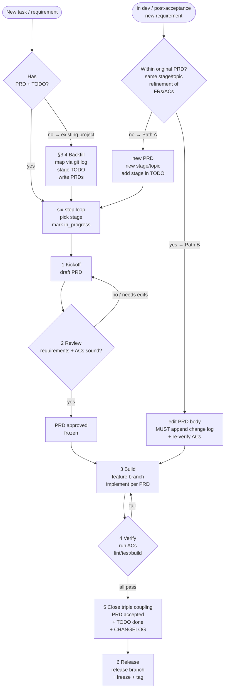

The biggest problem with AI pair development isn't "the AI isn't capable" — it's that **every session starts as a fresh hire**. No project memory, no knowledge of your conventions, prone to doing the right-looking thing in the wrong place. The rondo project solved this with a constraint system written into the repository.

I practiced it end to end, and distilled it into the **Rondo Method**: three pillars + one process loop + a change discipline + an all-PR merge flow. This post ships with a **downloadable asset pack** (Git hooks + spec templates + example PRD) — copy it into your project, adapt, and you're running the full system.

## 1. Why you need a system

> [!WARNING]
> If every new task requires verbally reminding the agent to "read the docs first, don't touch unrelated files, write proper commits" — your project lacks **machine-readable constraints**.

An AI agent has no persistent memory; its only stable input is **the files already in the repository**. So constraints must satisfy three properties:

| Property | Meaning | Mechanism |
|---|---|---|
| Written into the repo | readable by the agent | AGENTS.md / docs/ |
| Readable | fixed paths, clear conventions | TODO.yaml / PROCESS.md / PRD |
| Enforceable | machine-checked, not willpower | git hooks / CI |

==The one core principle==: **constraints live in the repo, are readable, and are machine-enforced — AI and humans play by the same rules.** Details scale to your project — the spec is a guardrail, not a maze.

## 2. The three pillars

### Pillar 1: PRD-driven development

**PRD first, code second** — no stage starts until its PRD is finalized (`approved`):

- The PRD is the **single source of truth**: requirements, implementation, tests, and acceptance all trace to it; building anything undefined in the PRD is forbidden
- **One PRD per stage**: `docs/prd/PRD-<stage>-<name>.md`, copied from the template
- **Failed acceptance = not done**: every item in the PRD's "Acceptance Criteria" must pass before TODO / CHANGELOG are updated

> [!TIP]
> The PRD template's value is **structure-as-discipline**: it forces a "Non-Goals" section (scope creep prevention) and executable acceptance criteria (prevents "looks fine").

### Pillar 2: AGENTS.md hard constraints

`AGENTS.md` is the behavior spec for all AI agents and human contributors — **read it fully before touching anything**:

```text
# Working style
- Follow the stage order in docs/TODO.yaml strictly; no skipping, no overstepping
- Read related docs and existing code before acting; follow existing patterns
- No undeclared dependencies; only touch files in scope

# Git (all-PR flow)
- main is never committed to directly; develop accepts only GitHub PR merges — no local merge
- feat/fix scope must cross-check against the stage id in the branch name
- Discipline is machine-enforced by .githooks/ — not by willpower
```

Key design: **rules must be machine-checkable**. The commit-msg hook parses `TODO.yaml` and validates stage ids in real time — typos are rejected on the spot. Human review gets tired and makes "just this once" exceptions; hooks don't.

### Pillar 3: TODO-list governance

`docs/TODO.yaml` is the **single execution source** — a structured task list expanded by roadmap stage:

```yaml
stages:
  - id: A
    name: Foundation
    steps:
      - id: A1
        title: CLI skeleton + config system
        status: done
        prd: docs/prd/PRD-A1-cli-config.md
        acceptance: all passed — pytest 20 passed, ruff clean
```

- Each step carries: **modules / acceptance criteria / status** (done / in_progress / todo)
- **Status coupling**: set `in_progress` at kickoff, flip to `done` only after acceptance; the PRD lifecycle moves in lockstep
- **Machine-consumed**: the commit hook reads it to validate stage ids — TODO is data for tools, not a to-do list for humans

## 3. The full development loop (six steps)

> This section is the execution skeleton: every step from requirement to release has a defined action, artifact, and status. **No stage starts without a finalized PRD.**

### 3.1 The six-step loop

```
Kickoff → Review → Build → Verify → Close → Release
```

| Step | Action | Artifact / Status |
|---|---|---|
| 1. Kickoff | Pick a stage from `docs/TODO.yaml`, **mark it `in_progress`**, draft the PRD | `PRD-<stage>-<name>.md` (status: draft) |
| 2. Review | Walk through requirements and acceptance criteria, finalize | PRD status: `approved` (frozen; changes go through "Change Log") |
| 3. Build | Implement per PRD; branch `feature/<stage>-<task>` | code + tests; PRD status: in development |
| 4. Verify | Run every acceptance item (lint / test / build / manual) | all pass → close; any fail → back to build |
| 5. Close | **Triple coupling, none optional**: PRD `accepted` + TODO `done` + CHANGELOG entry | push feature branch → GitHub PR into develop |
| 6. Release | release branch + version freeze + regression + tag | `release/<ver>` → main + tag |

### 3.2 PRD lifecycle state machine

Every state transition has an explicit trigger; **requirement changes can interrupt the main flow at any time**, routed by the state machine:

```text
// ── PRD lifecycle state machine (with requirement-change fork) ──
// States: draft → review → approved → in development → accepted

STATE = draft

// Main flow (six-step loop)
kickoff: pick stage from TODO.yaml → copy template, write PRD → STATE = draft
review:  walk through requirements and ACs
         → all sound ? STATE = approved (frozen) : back to draft for edits
build:   implement per PRD (PRD is the only source; no overreach) → STATE = in development
verify:  run ACs one by one (lint / test / build / manual)
         → all pass ? STATE = accepted : back to in development (fix, re-verify)
close:   status coupling (PRD accepted + TODO done + CHANGELOG entry)

// ── Requirement-change fork (any state) ──
on new requirement:

    // Which path: new PRD or amend?
    if requirement fits the original PRD scope (same stage / same topic /
       refinement of existing FRs·ACs) and hasn't diverged into a new direction:
        → take 【Path B】amend the PRD
    else (new stage / brand-new topic / scope crosses the PRD boundary):
        → take 【Path A】open a new PRD

// Path A: new PRD
Path A:
    pick or add a stage in TODO.yaml (mark in_progress)
    copy PRD-TEMPLATE.md → docs/prd/PRD-<stage>-<name>.md
    return to 【Kickoff】

// Path B: amend the PRD
Path B:
    edit the PRD body (update the relevant FRs / ACs / tech design)
    MUST append to the "Change Log" at the end: date + what changed + why
    // the log entry is mandatory — it's the audit trail for requirement changes
    MUST re-verify affected ACs:
        if STATE == approved:      update ACs, stay approved
        elif STATE == in dev:      re-run affected ACs → continue only if they pass
        elif STATE == accepted:    re-run affected ACs → if they fail, STATE = in development
```

### 3.3 The requirement-change fork

Requirement changes are the norm; the key is **judge first, then act**. The fork criteria:

| Dimension | Path A: new PRD | Path B: amend the PRD |
|---|---|---|
| Stage | new TODO stage / cross-stage | within the same stage |
| Topic | brand-new direction | incremental refinement of the same topic |
| Scope | crosses the PRD boundary | correction/supplement to existing FRs·ACs |
| PRD state | accepted and the need is a different thing | any state (incl. small tweaks after acceptance) |
| Action | copy template, new doc, full loop | edit body + **MUST log the change at the end** |

> [!IMPORTANT]
> **Path B discipline**: when you amend a PRD, you MUST append one line to its "Change Log" (date + what changed + why) and re-verify the affected acceptance criteria. It's the **audit trail** for requirement changes — without it the PRD silently drifts, code and docs decouple again, and the whole system collapses.

### 3.4 Backfilling an existing project (no PRD/TODO yet)

Many projects are **already in development** and never had PRD / TODO / a spec system. Don't pretend to "start from zero" — backfill the history into assets first, then let the new rules take over:

```
① Map the evolution: git log --oneline --date=short (group by feature/version)
     ↓
② Split into stages: cut milestones into N stages (e.g. foundation / core / polish / close)
     ↓
③ Backfill TODO: one line per stage (modules + acceptance + status done/todo)
     ↓
④ Backfill PRDs: copy the template; infer FRs/ACs from code and CHANGELOG
```

- **Historical features = `done`, future plans = `todo`** — existing code is proof of done.
- PRD status by reality: shipped feature → `accepted`; exists but no acceptance record → `approved` + note "backfilled, acceptance to be re-verified".
- **Backfilling is not fabrication**: if you can't write an acceptance criterion, mark it "to be re-verified" — don't pretend history had one.

## 4. Git Flow companion (all-PR)

### 4.1 Branch model

```
main            ← release versions only (protected: never committed to directly)
  └─ develop    ← daily integration branch (default base; only PR merges)
       ├─ feature/<name>   new feature / task (branched from develop)
       ├─ release/<ver>    release prep (version freeze, regression)
       └─ hotfix/<name>    production hotfix (from main; merged back to main + develop)
```

### 4.2 The all-PR flow (core)

**Every change entering develop goes through a GitHub PR/MR (Code Review)** — push the feature branch locally, never merge develop locally:

| Path | Method | Forbidden |
|---|---|---|
| `feature/*` → `develop` | push branch → GitHub PR merge | local `git merge --no-ff` into develop |
| `develop` → `main` | via `release/*` branch, open PR | local `git merge` |
| `main` → `develop` | hotfix backflow via PR | local `git merge` |

**Why all-PR**: every change is human-reviewed before entering the trunk; PRs leave a trail (discussion, review comments, merge record); a local merge into develop bypasses review. GitHub free-tier private repos can't enable server-side branch protection — the **local pre-push hook is the replacement** (see §4.4).

### 4.3 Commit convention

`<type>(<scope>): <subject>`, Chinese subject; feat/fix scope must be a real stage id from TODO; feat additionally requires the corresponding PRD staged.

### 4.4 Machine enforcement (hooks)

- `.githooks/commit-msg`: type whitelist / stage existence / feat-with-PRD / branch-name cross-check
- `.githooks/pre-push`: all-PR protection — **main double protection** (no non-main → main; no local merge) + **develop triple protection** (no delete / no feature → develop / no local ahead-of-remote)
- **AI and humans play by the same rules**: no "the agent gets a pass" exceptions

## 5. Full flowchart



## 6. Asset pack (download and adapt)

The core files have been extracted as assets — **download, adapt to your project, and you're running the system**:

> [!asset] rondo-method/AGENTS.md
> Full behavior spec for AI agents — working style / code style / Git Flow (all-PR) / testing / docs / PRD-driven / security. The entry file of the whole constraint system.

> [!asset] rondo-method/.githooks/pre-push
> Push protection hook — enforces the all-PR flow: main double protection + develop triple protection (no delete / no feature → develop / no local ahead). Copy to `.githooks/` and `git config core.hooksPath .githooks`.

> [!asset] rondo-method/.githooks/commit-msg
> Commit-validation hook wrapper (sh) — calls check_commit_msg.py.

> [!asset] rondo-method/.githooks/check_commit_msg.py
> Commit-validation logic (Python) — type whitelist / stage existence / feat-with-PRD / branch-name cross-check; customize the "cut points" config block at the top (module scopes, TODO/PRD paths).

> [!asset] rondo-method/docs/TODO.yaml
> Structured task-list template — expanded by stage, each step with modules and acceptance, machine-consumed by the hook.

> [!asset] rondo-method/docs/PROCESS.md
> Process playbook — six-step loop + status coupling + existing-project backfill flow.

> [!asset] rondo-method/docs/prd/PRD-TEMPLATE.md
> PRD template — structure-as-discipline: forces Non-Goals and executable acceptance criteria; the trailing "Change Log" is where Path B lands.

> [!asset] rondo-method/docs/prd/PRD-example.md
> Example PRD (accepted form) — what a finalized PRD looks like, with checked FRs/ACs and change-log entries.

> [!asset] rondo-method/README.md
> Asset guide — file list / new-project landing steps / existing-project backfill steps / adaptation guide / dependency map.

> [!TIP]
> Copy the whole `public/assets/rondo-method/` directory into your repo (including `.githooks/`), then follow the landing steps in README.md.

## 7. Adapting to your scale

The Rondo Method is battle-tested in the rondo project; it scales up and down:

| Scale | Combination | Covers |
|---|---|---|
| Minimal | `AGENTS.md` + `PROCESS.md` + `PRD-TEMPLATE.md` | tames "how the agent works" |
| Medium | add `TODO.yaml` | stage progression + status coupling |
| Full | add Git Flow + hooks (this pack) | even commits and pushes are machine-checked |

| Scenario | Adaptation |
|---|---|
| Solo / tiny project | drop the PRD six-step loop; scope can use module names instead of stage ids |
| Frontend project | swap the code-style section for the frontend toolchain; module scopes → component/package names |
| No PRD | delete the PRD templates; the feat-with-PRD check auto-skips |
| Single-main branch | drop develop/feature model; keep only the main protection in pre-push |

## 8. One-click landing: let AI install the system

Copy the prompt below and send it to your AI collaborator (Claude / Cursor / others). It reads this post and the assets, **analyzes your project's current state, and lands the Rondo Method into it** — adapting AGENTS.md, backfilling TODO/PRD, adding Git hooks:

```text
<role>
You are the "Rondo Method installer". Task: transform the target project into one that
follows the Rondo Method spec (see the article below).
Target project path: <fill in your project path>
</role>

<must_read>
MUST read the article in full (all content, tables, and code examples):
https://quanming1.github.io/minimal-blog/posts/rondo-method/

MUST read the asset files in section 6 (templates and examples to land):
- AGENTS.md          — hard behavior spec for AI agents (landing template; adapt to the project)
- PROCESS.md         — PRD-driven six-step loop playbook
- TODO.yaml          — structured task list format (reference for backfilling the project TODO)
- PRD-TEMPLATE.md    — PRD template (new stages copy from it)
- PRD-example.md     — example PRD (accepted form; reference when backfilling)
- .githooks/pre-push + commit-msg + check_commit_msg.py — Git hooks (all-PR protection + commit validation)
</must_read>

<analyze>
MUST analyze the target project before touching anything:
- read existing AGENTS.md / README / docs/ structure
- check git state: branch model (git branch -a), hooks enabled (git config core.hooksPath)
- map the project's evolution with git log (group by feature/version → basis for TODO)
</analyze>

<landing>
Land the spec incrementally by project size (verify each step; don't change everything at once):
1. Adapt AGENTS.md: add working style (TODO-driven) / code style / Git rules (all-PR) / PRD-driven
   sections; keep existing reasonable conventions; trim by scale (single-main projects need no develop/feature model)
2. Backfill docs/TODO.yaml: stages from the project's actual evolution (history = done, future = todo),
   each with modules / acceptance / status — format per the asset TODO.yaml
3. Create docs/PROCESS.md + docs/prd/: six-step loop; copy PRD-TEMPLATE.md for the first future
   stage's PRD (have the user review before marking approved)
4. Add Git hooks: .githooks/commit-msg + check_commit_msg.py (type/scope/subject whitelist)
   + pre-push (all-PR trunk protection); customize scope whitelist per project modules
   (the "cut points" block at the top of check_commit_msg.py); run git config core.hooksPath .githooks
5. Sync docs: README / AGENTS.md reference the new spec files (TODO/PROCESS/PRD paths)
</landing>

<rules>
- MUST analyze first, then change; don't break existing functionality (after each step, the project's
  own verification stays green: lint/test/build)
- MUST respect existing project conventions (language/style/deps/docs); touch only spec-related files
- Ask before deciding key choices: whether to introduce develop, scope = stage id vs module name,
  whether hooks duplicate existing CI checks — give a recommendation and get user confirmation
- NEVER fake completion with TODO/placeholder content; give verifiable evidence for each item
  (file path + key content)
</rules>
```

> [!TIP]
> The prompt is **self-contained**: the AI reads the spec via URL, reads the templates via the asset list, then **analyzes your project and acts** — it won't copy rondo's Python specifics, but adapts to your stack and evolution. Key decisions (branch model, scope strategy) it must ask you about, not decide unilaterally.

> [!IMPORTANT]
> This method completed the full loop in rondo: from foundation to multi-loop orchestration, hundreds of commits all traceable to specific stages, PRD and code always in sync, not a single "meaningless commit". It doesn't solve "whether AI can write code" — it solves "how to keep what AI writes under control".
