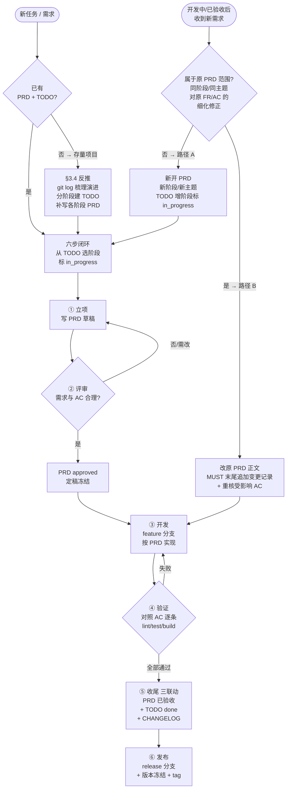

AI 结对开发最大的问题不是「AI 能力不够」，而是「AI 每次都是新人」——它没有项目记忆、不知道你的约定、容易在错误的地方白干。rondo 项目用一套写进仓库的约束体系解决了这个问题。

这套体系我完整实践过，现在提炼为 **Rondo 方法**：三个支柱 + 一个流程闭环 + 一套变更纪律 + 全 PR 流合并。本文附带**可复制落地的完整资产包**（Git Hooks + 规范模板 + 示例 PRD），下载后改造成自己的项目即可。

## 1. 为什么需要一套规范

> [!WARNING]
> 如果每次开新任务都要口头叮嘱 agent「记得先读文档、别乱改文件、提交要规范」，说明你的项目缺少**机器可读的约束**。

AI agent 没有上下文记忆，它唯一稳定的输入是**当前仓库里的文件**。所以约束必须满足三条：

| 约束性质 | 含义 | 手段 |
|---|---|---|
| 写进仓库 | 能被 agent 读取 | AGENTS.md / docs/ 目录 |
| 能被读取 | 路径固定、约定明确 | TODO.yaml / PROCESS.md / PRD |
| 能被强制 | 机器校验而非自觉 | git hooks / CI |

==核心原则只有一条==：**约束写进仓库、能被读取、能被强制，AI 与人类同规则**。细节按项目规模裁剪——规范是护栏，不是迷宫。

## 2. 三大支柱

### 支柱一：PRD 驱动开发

**先 PRD，后开发**——每个 TODO 阶段开工前，必须有定稿（`approved`）的 PRD：

- PRD 是**开发的唯一依据**：需求、实现、测试、验收全部对照 PRD；禁止开发 PRD 未定义的内容
- **一阶段一 PRD**：`docs/prd/PRD-<阶段>-<名称>.md`，从模板复制
- **验收不通过 = 未完成**：PRD「验收标准」逐条核对，全部通过才更新 TODO / CHANGELOG

> [!TIP]
> PRD 模板的价值在于**结构即纪律**：强制写「非目标」（防范围蔓延）和「可执行的验收标准」（防「看起来不错」）。

### 支柱二：AGENTS.md 硬约束

`AGENTS.md` 是对所有 AI agent 和人类协作者的行为规范，**动手前必须完整阅读并遵守**：

```text
# 工作方式
- 严格按 docs/TODO.yaml 的阶段顺序推进，不跳步、不越权
- 动手前先读相关文档与现有代码，遵循已有模式；不另起一套并行模式
- 不引入未声明的依赖；只改任务范围内的文件

# Git 强制（全 PR 流）
- main 永不直接提交；develop 只接受 GitHub PR 合入，本地禁止 merge
- feat/fix 的 scope 必须与分支名中的阶段 id 交叉校验
- 规范不靠自觉，全部由 .githooks/ 本地 hook 强制
```

关键设计：**规则要能被机器校验**。commit-msg hook 解析 `TODO.yaml` 实时比对阶段 id，写错直接拒绝——人工 review 会疲劳、会「这次破例」，hook 不会。

### 支柱三：TODO 清单驱动

`docs/TODO.yaml` 是**开发的唯一执行依据**——结构化任务清单，按路线图分阶段展开：

```yaml
stages:
  - id: A
    name: 地基
    steps:
      - id: A1
        title: CLI 骨架 + 配置系统
        status: done
        prd: docs/prd/PRD-A1-cli-config.md
        acceptance: 全部通过——pytest 20 passed、ruff 全过
```

- 每步含：**涉及模块 / 验收标准 / 状态**（done / in_progress / todo）
- **状态联动**：立项标 `in_progress`，验收通过才改 `done`；PRD 生命周期同步推进
- **机器消费**：commit hook 直接读它校验阶段 id——TODO 是给工具用的数据，不是给人看的清单

## 3. 开发的所有流程（六步闭环）

> 本节是 Rondo 方法的执行骨架：从需求到上线，每一步都有明确的动作、产物与状态。**任何阶段没有定稿的 PRD 不开工。**

### 3.1 六步闭环

```
立项 → 评审 → 开发 → 验证 → 收尾 → 发布
```

| 步骤 | 动作 | 产物 / 状态 |
|---|---|---|
| 1. 立项 | 从 `docs/TODO.yaml` 选定一个阶段，**TODO 标 `in_progress`**，撰写 PRD | `PRD-<阶段>-<名称>.md`（状态：草稿） |
| 2. 评审 | 逐条核对需求与验收标准，定稿 | PRD 状态：`approved`（定稿后冻结，变更需走「变更记录」） |
| 3. 开发 | 按 PRD 需求实现；分支 `feature/<阶段>-<任务>` | 代码 + 测试；PRD 状态：开发中 |
| 4. 验证 | 对照 PRD「验收标准」逐条执行（lint / test / build / 手动） | 全部通过 → 进入收尾；失败 → 回开发 |
| 5. 收尾 | **三联动缺一不可**：PRD 标 `已验收` + TODO 标 `done` + CHANGELOG 追加 | push feature 分支 → GitHub PR 合入 develop |
| 6. 发布 | release 分支 + 版本冻结 + 回归 + tag | `release/<ver>` → main + tag |

### 3.2 PRD 生命周期状态机

PRD 的每个状态迁移都有明确触发条件；**需求变更随时可能打断主流程**，由状态机统一分流：

```text
// ── PRD 生命周期状态机（含需求变更双路径分流）──
// 状态：草稿 → 评审 → approved → 开发中 → 已验收

STATE = 草稿

// 主流程（六步闭环）
立项:   从 TODO.yaml 选阶段 → 复制模板写 PRD → STATE = 草稿
评审:   逐条核对需求与 AC
        → 全部合理 ? STATE = approved（定稿冻结）: 返回草稿修改
开发:   按 PRD 实现（PRD 是唯一依据，不越界）→ STATE = 开发中
验证:   对照 AC 逐条执行（lint / test / build / 手动）
        → 全部通过 ? STATE = 已验收 : 返回开发中（修复后重验）
收尾:   状态联动（PRD 已验收 + TODO done + CHANGELOG 追加）

// ── 需求变更分流（任意状态收到新需求时）──
on 收到新需求:

    // 路径判断：要不要新开 PRD？
    if 需求属于原 PRD 范围（同阶段/同主题/对原 FR·AC 的细化修正）
       and 原 PRD 未进入完全不同的方向:
        → 走【路径 B】修改原 PRD
    else（新阶段 / 全新主题 / 范围跨越原 PRD 边界）:
        → 走【路径 A】新开 PRD

// 路径 A：新开 PRD
路径A:
    TODO.yaml 选定/新增阶段（标 in_progress）
    复制 PRD-TEMPLATE.md → docs/prd/PRD-<阶段>-<名称>.md
    回到主流程【立项】开始

// 路径 B：修改原 PRD
路径B:
    修改原 PRD 正文（更新对应 FR / AC / 技术方案）
    MUST 在 PRD 末尾「变更记录」追加: 日期 + 变更内容 + 理由
    // 修改记录是强制动作——它是需求变更的审计轨迹，不可省略
    MUST 重新核对受影响 AC：
        if STATE == approved:   更新 AC 后保持 approved
        elif STATE == 开发中:   重跑受影响 AC → 通过才继续
        elif STATE == 已验收:   重跑受影响 AC → 不通过则 STATE = 开发中
```

### 3.3 需求变更双路径

需求变更是常态，关键是**先判断再动手**。两个路径的判据：

| 判断维度 | 路径 A：新开 PRD | 路径 B：修改原 PRD |
|---|---|---|
| 阶段 | 新 TODO 阶段 / 跨阶段 | 同一阶段内 |
| 主题 | 全新方向 | 同主题增量/细化 |
| 范围 | 超出原 PRD 边界 | 原 FR/AC 的修正补充 |
| 原 PRD 状态 | 已验收且新需求是另一件事 | 任意状态（含已验收后的小调整） |
| 动作 | 复制模板新建文档，走完整闭环 | 改正文 + **MUST 末尾记变更记录** |

> [!IMPORTANT]
> **路径 B 的纪律**：修改原 PRD 时，MUST 在文档末尾「变更记录」小节追加一行（日期 + 变更内容 + 理由），并重新核对受影响的验收标准。这是需求变更的**审计轨迹**——没有它，PRD 悄悄漂移，代码与文档再次脱节，整个体系就失效了。

### 3.4 存量项目反推（没有 PRD/TODO 怎么办）

很多项目**已经在开发中**，从未建立 PRD / TODO / 规范体系。此时不能假装「从零开始」——先用反推把历史沉淀成资产，再让新规范接管：

```
① 梳理演进：git log --oneline --date=short（按功能/版本分组）
     ↓
② 分阶段：按里程碑切成 N 个阶段（如 地基/核心功能/优化/收尾）
     ↓
③ 补 TODO：每个阶段一行（含模块 + 验收标准 + 状态 done/todo）
     ↓
④ 补 PRD：从模板复制，FR/AC 从代码与 CHANGELOG 反推
```

- **历史功能标 `done`，未来规划标 `todo`**——已存在的代码 = done 的证明。
- 补 PRD 时状态按实际：功能已上线 → `已验收`；存在但无验收记录 → `approved` + 备注「反推补写，验收标准待复核」。
- **反推不是编造**：写不出来的验收标准就标「待复核」，不假装历史有过。

## 4. Git Flow 配套（全 PR 流）

### 4.1 分支模型

```
main            ← 仅存放可发布版本（受保护语义：永不直接提交）
  └─ develop    ← 日常集成分支（默认工作基底，只接受 PR 合入）
       ├─ feature/<name>   新功能 / 新任务（从 develop 切出）
       ├─ release/<ver>    发布准备（版本号冻结、回归测试）
       └─ hotfix/<name>    生产紧急修复（从 main 切出，修完回灌 main + develop）
```

### 4.2 全 PR 流（核心）

**所有合入 develop 的改动一律走 GitHub PR/MR（Code Review）**——本地只 push feature 分支，不本地 merge develop：

| 路径 | 方式 | 禁止 |
|---|---|---|
| `feature/*` → `develop` | push 分支 → GitHub PR 合入 | 本地 `git merge --no-ff` 合并回 develop |
| `develop` → `main` | 走 `release/*` 分支提 PR | 本地 `git merge` |
| `main` → `develop` | hotfix 回灌走 PR | 本地 `git merge` |

**为什么全 PR 流**：每笔改动进入集成主干前都经过人审；PR 天然留痕（讨论、审查意见、合入记录）；本地 merge 到 develop 会绕过审查。GitHub free 账号 private 仓库无法开启服务端 branch protection——用**本地 pre-push hook 强制替代**（见 §4.4）。

### 4.3 提交规范

`<type>(<scope>): <subject>`，subject 中文；feat/fix 的 scope 必须是 TODO 里真实存在的阶段 id；feat 额外强制暂存必须包含对应 PRD。

### 4.4 机器强制（hooks）

- `.githooks/commit-msg`：校验 type 白名单 / 阶段存在性 / feat 带 PRD / 分支名交叉校验
- `.githooks/pre-push`：全 PR 流保护——**main 双重保护**（非 main 禁推 main + 本地 merge 禁推）+ **develop 三重保护**（禁删 / 禁 feature 直推 develop / 本地领先即拒）
- **AI 与人类同规则**：没有「agent 可以特殊」的例外

## 5. 完整流程图



## 6. 关键文件资产（可直接复制落地）

整套规范的核心文件已抽取为资产，**下载后改造成自己的项目即可**：

> [!asset] rondo-method/AGENTS.md
> 给 AI agent 的强制行为规范全文——工作方式 / 代码风格 / Git Flow（全 PR 流）/ 测试 / 文档 / PRD 驱动 / 安全边界。这是整套约束的入口文件。

> [!asset] rondo-method/.githooks/pre-push
> push 保护 hook——全 PR 流强制：main 双重保护 + develop 三重保护（禁删 / 禁 feature 直推 / 本地领先即拒）。复制到项目 `.githooks/` 并 `git config core.hooksPath .githooks` 启用。

> [!asset] rondo-method/.githooks/commit-msg
> 提交校验 hook 包装（sh）——调用 check_commit_msg.py 校验提交格式。

> [!asset] rondo-method/.githooks/check_commit_msg.py
> 提交校验逻辑（Python）——type 白名单 / 阶段存在性 / feat 带 PRD / 分支名交叉校验；顶部「裁剪点」配置区（模块 scope、TODO/PRD 路径）按项目修改。

> [!asset] rondo-method/docs/TODO.yaml
> 结构化任务清单模板——按阶段展开、每步含模块与验收标准、可被 hook 机器消费。

> [!asset] rondo-method/docs/PROCESS.md
> 推进管理办法——六步闭环 + 状态联动 + 存量项目反推流程。

> [!asset] rondo-method/docs/prd/PRD-TEMPLATE.md
> PRD 文档模板——结构即纪律，强制写清非目标与可执行的验收标准；末尾「变更记录」小节是路径 B 的落点。

> [!asset] rondo-method/docs/prd/PRD-example.md
> 示例 PRD（已验收形态）——展示一份定稿 PRD 长什么样，含已勾选的 FR/AC 与变更记录留痕。

> [!asset] rondo-method/README.md
> 资产说明——文件清单 / 新项目落地步骤 / 存量项目反推步骤 / 裁剪指南 / 文件依赖关系。

> [!TIP]
> 复制后建议把 `public/assets/rondo-method/` 整个目录拷到项目仓库（含 `.githooks/`），按 README.md 的落地步骤执行。

## 7. 落地裁剪

Rondo 方法是 rondo 项目的实战沉淀，规模可大可小：

| 规模 | 组合 | 覆盖 |
|---|---|---|
| 最小 | `AGENTS.md` + `PROCESS.md` + `PRD-TEMPLATE.md` | 管住「agent 怎么干活」 |
| 中等 | 加 `TODO.yaml` | 有阶段推进、有状态联动 |
| 完整 | 加 Git Flow + hooks（本资产包） | 连提交与推送都机器校验 |

| 场景 | 裁剪 |
|---|---|
| 单人 / 微型项目 | 去掉 PRD 六步闭环；scope 可不用阶段 id（改模块名） |
| 前端项目 | AGENTS.md 代码风格换前端工具链；模块 scope 换组件/包名 |
| 不用 PRD | 删 PRD 模板与示例；feat 带 PRD 校验自动跳过 |
| 单 main 分支 | 删 develop/feature 模型，pre-push 只留 main 保护 |

## 8. 一键落地：让 AI 把这套规范安装到你的项目

把下面这段提示词**一键复制**发给你的 AI 协作者（Claude / Cursor / 其他），它会先读这篇文章与资产，然后**分析你项目的现状，把 Rondo 方法规范落地进去**——改造 AGENTS.md、反推 TODO/PRD、加 Git Hooks，让项目从此按这套规范运转：

```text
<role>
你是「Rondo 方法落地器」。任务：把目标项目改造为符合 Rondo 方法规范的工程（规范见下方文章）。
目标项目路径：<在这里填入你的项目路径>
</role>

<must_read>
MUST 先完整阅读这篇文章（含全部内容、表格与代码示例）：
https://quanming1.github.io/minimal-blog/posts/rondo-method/

MUST 阅读文章中提供的资产文件（第 6 节，作为落地模板与样例）：
- AGENTS.md          —— 给 AI agent 的强制行为规范（落地模板，需按项目裁剪）
- PROCESS.md         —— PRD 驱动六步闭环推进办法
- TODO.yaml          —— 结构化任务清单结构（反推项目 TODO 的格式参照）
- PRD-TEMPLATE.md    —— PRD 模板（新阶段从模板复制）
- PRD-example.md     —— 示例 PRD（已验收形态，反推项目 PRD 时对照参考）
- .githooks/pre-push + commit-msg + check_commit_msg.py —— Git Hooks（全 PR 流保护 + 提交校验）
</must_read>

<analyze>
MUST 先分析目标项目现状，再动手改：
- 读现有 AGENTS.md / README / docs/ 目录结构
- 查 git 现状：分支模型（git branch -a）、hooks 是否启用（git config core.hooksPath）
- 用 git log 反推项目演进（按功能/版本分阶段，为 TODO 提供依据）
</analyze>

<landing>
按项目规模把规范逐项落地（每项完成即验证，不一次全改）：
1. 改造 AGENTS.md：补工作方式（TODO 驱动）/ 代码风格 / Git 规范（全 PR 流）/ PRD 驱动章节；
   保留项目原有合理约定；按规模裁剪（单 main 分支项目不需要 develop/feature 分支模型）
2. 反推 docs/TODO.yaml：按项目实际演进分阶段（历史功能标 done + 未来规划 todo），
   每步含：涉及模块 / 验收标准 / 状态——格式参照资产 TODO.yaml
3. 建立 docs/PROCESS.md + docs/prd/：六步闭环推进办法；从 PRD-TEMPLATE.md 复制
   第一个未来阶段的 PRD（标 approved 前先给用户评审）
4. 加 Git Hooks：.githooks/commit-msg + check_commit_msg.py（校验 type/scope/subject 白名单）
   + pre-push（全 PR 流保护主干）；scope 白名单按项目模块定制（check_commit_msg.py 顶部「裁剪点」）；
   执行 git config core.hooksPath .githooks
5. 文档同步：README / AGENTS.md 引用新规范文件（TODO/PROCESS/PRD 路径）
</landing>

<rules>
- MUST 先分析再改；不破坏现有功能（每步落地后跑项目自身验证：lint/test/build 保持绿）
- MUST 尊重项目已有约定（语言/风格/依赖/文档），只改规范相关文件
- 关键决策先问再定：是否引入 develop 分支、scope 用阶段 id 还是模块名、
  hooks 是否与 CI 现有检查重复——给出建议并让用户确认，不擅自决定
- NEVER 用 TODO、占位内容假装落地完成；每项落地给出可验证的证据（文件路径 + 关键内容）
</rules>
```

> [!TIP]
> 提示词是**自包含**的：AI 靠 URL 读规范、靠资产清单读模板，然后**分析你的项目现状再动手**——它不会套用 rondo 的 Python 细节，而是按你项目的技术栈与演进裁剪落地。关键决策（分支模型、scope 策略）它必须问你，不擅自定。

> [!IMPORTANT]
> 这套方法在 rondo 里跑通了完整闭环：从地基到 multi-loop 编排，上百条提交全部可追溯到具体阶段，PRD 与代码始终同步，没有一条「无意义提交」。它解决的不是「AI 会不会写代码」，而是「AI 写的东西怎么不失控」。
